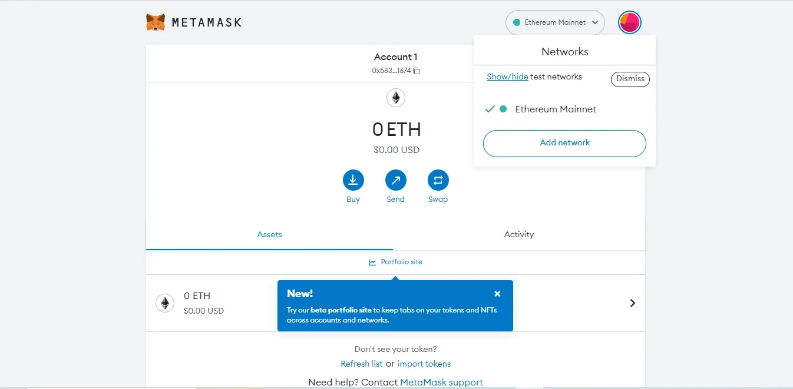

# Add Arbitrum network to MetaMask

To add the Arbitrum network to MetaMask, you need to follow these steps:

1\. **Navigate to network settings in MetaMask:**

<figure><figcaption></figcaption></figure>

* Click the network list in the left corner of the MetaMask interface.
* Select "Ethereum Mainnet".

2\. **Add Arbitrum network**\
Click on the network list again and select "Arbitrum One".

<figure><figcaption></figcaption></figure>

* A dialog box will appear showing the following details:
* **Network name** : Arbitrum One
* Network URL: https://arbitrum-mainnet.infura.io
* **Chain code** : 42161
* **Currency symbol** : ETH
* Block explorer URL: [https://explorer.arbitrum.io](https://explorer.arbitrum.io/)

<figure><figcaption></figcaption></figure>

After completing these steps, you will see the Arbitrum network listed in the network drop-down menu. Switch to Arbitrum network and start using it to make faster and cheaper transactions.

#### Add Arbitrum token to MetaMask

1. **To add Arbitrum tokens to the MetaMask wallet, follow these steps:**

* Click on the MetaMask icon to open the wallet interface.
* Scroll to the bottom of the page and click the "Import token" menu.
* Add custom tokens to MetaMask:

<figure><figcaption></figcaption></figure>

<figure><figcaption></figcaption></figure>

* [https://arbiscan.io/](https://arbiscan.io/)

2. **Find the contract address and decimal value of the desired token:**

* Access the Arbitrum block discovery ().

<figure><figcaption></figcaption></figure>

* Search for the token you want to add to your wallet.
* Record the token contract address and decimal value.

3. **Add the token to MetaMask with the correct contract address and decimal value:**

* Return to the MetaMask wallet interface and paste the token contract address into the "Token contract address" field.
* Enter the token symbol and decimal value in the corresponding fields.
* Click the "Next" button.
* Click the "Add Token" button to complete the process.

Once completed, you will see the token listed in your MetaMask wallet. You can send and receive this token like any other asset in your wallet.
